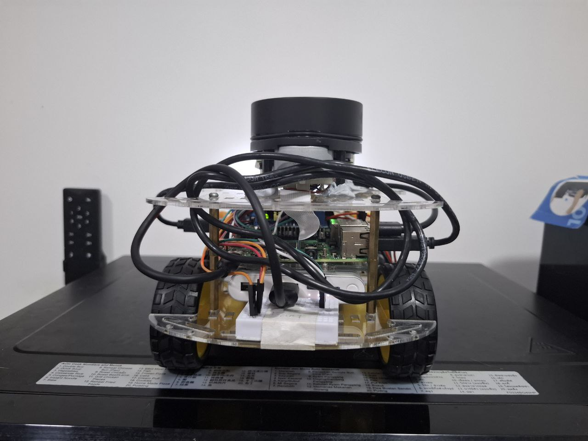
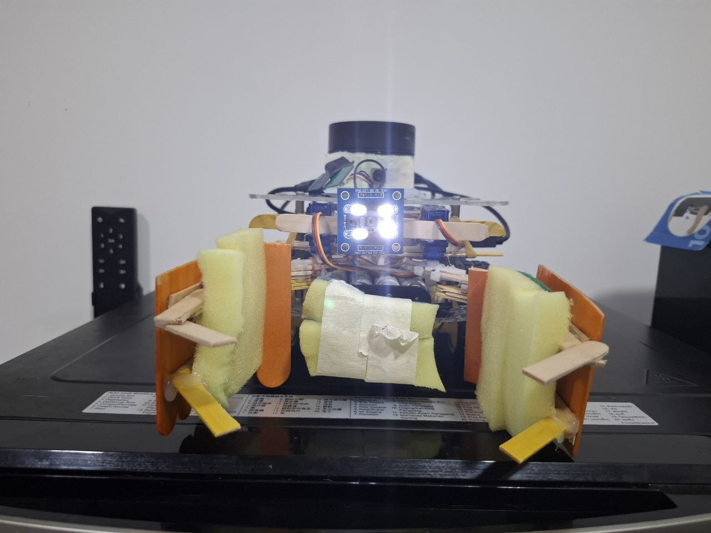
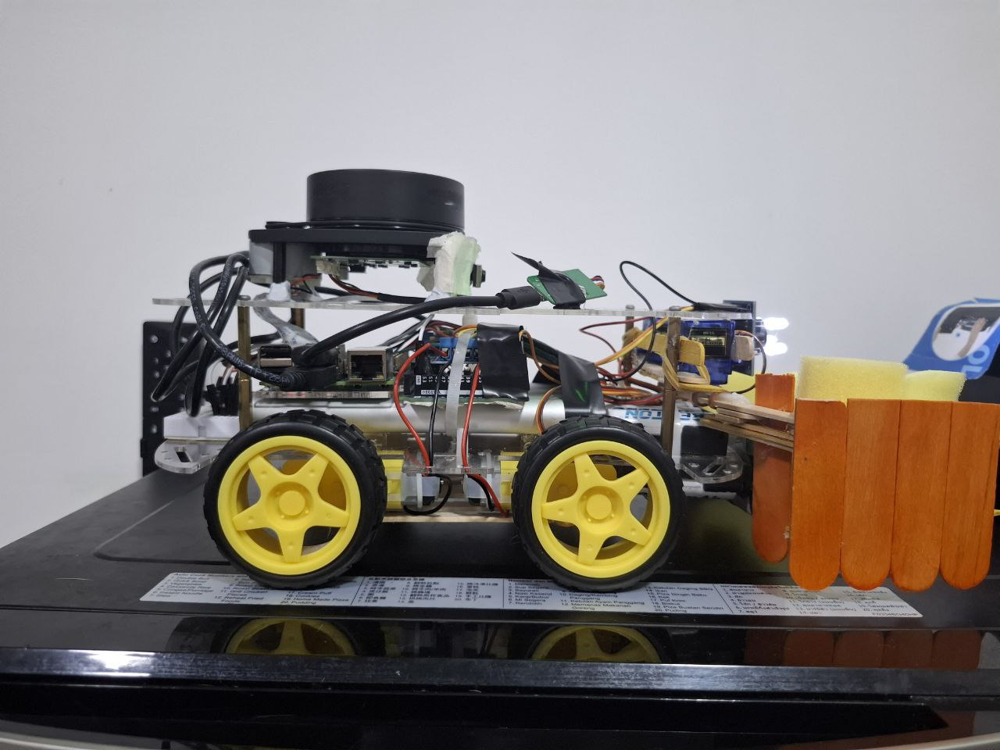
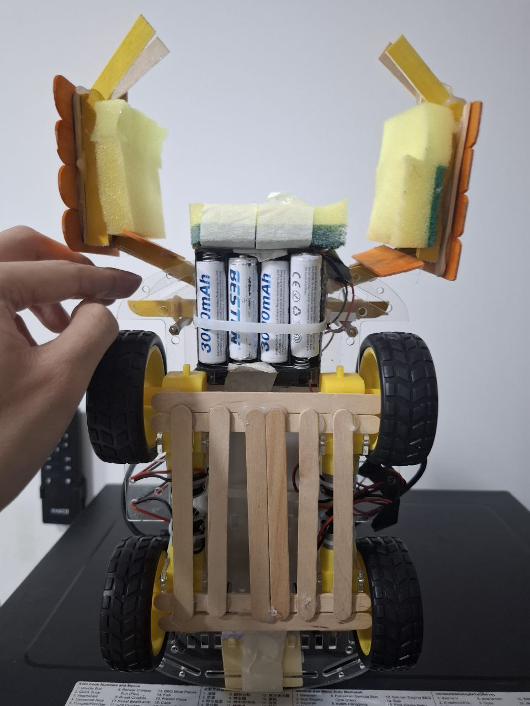

# Alex to the Rescue Project
Our task is to build a robot capable of navigating an unknown environment using LIDAR data. Along the way, the robot will encounter astronauts of different colours, each requiring a specific type of attention to be successfully "rescued." The robot must interpret these visual cues, plan its path accordingly, and maneuver through the space efficiently to complete the mission.

Pictures of our Alex:
|  |  |
|:--------------------:|:---------------------:|
| Back View           | Front View            |
|  |  |
| Side View           | Bottom View           |

## Implementation
The full explanation of our robot implementation can be viewed in our group report [here](/report.pdf)

## Alex Control Program
Once the hardware connections have been verified, upload the Arduino program called `Alex.ino` in `Alex` folder to the Arduino Uno. Other files `.ino` are tabs to the main file and should be compiled together. Ensure that they are recognised as tabs for the program to compile correctly.

### Compile
Next, compile the `alex-pi.cpp` program to control Alex:
```bash
gcc alex-pi.cpp serial.cpp serialize.cpp -pthread -o Alex-pi
```

### Run
Run the generated executable file to start sending commands to the Arduino to operate Alex:
```bash
./Alex-pi
```

## Format
To make our code clean and easy to read, also to keep the good coding habit from CS1010, we use `clang-format` to format our code. To format you code, you can execute the following steps on RPi, or any Ubuntu/Debian system.

```bash
sudo apt install clang-format # install clang-format
clang-format -i filname # format the code using clang
```